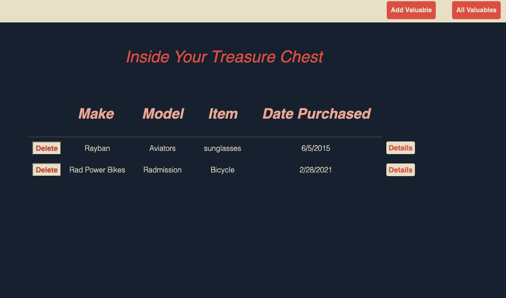
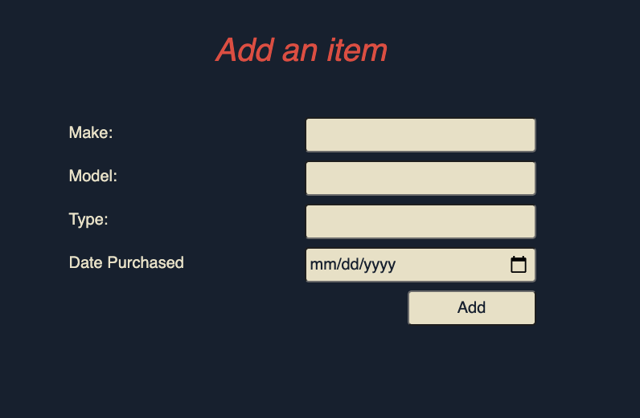
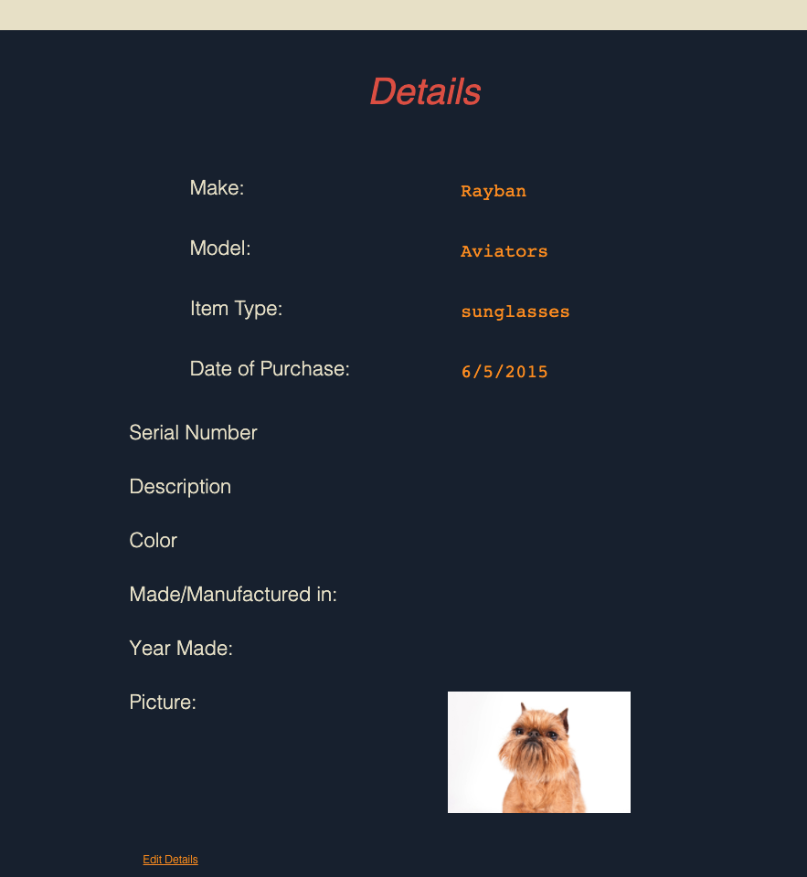
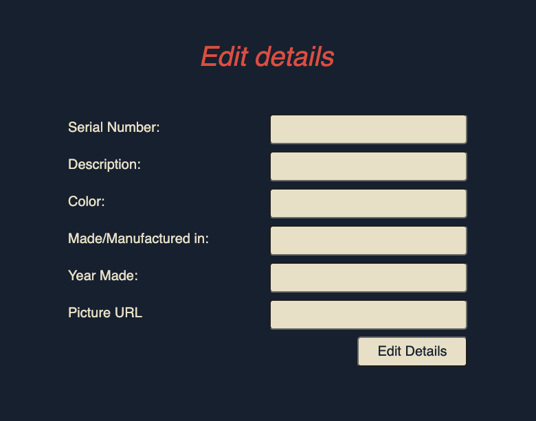

# Treasure Chest Inventory Application
 

#### A simple inventory application that stores important information about all your valuable items
  

## Technologies Used:
HTML5, CSS, Javascript, Node.js, MongoDB, Heroku

## How to Start:
### This App is hosted on Heroku:  
#### To begin click <a href="https://treasure-chest-inventory.herokuapp.com/valuables">here</a>, you will add an item by clicking "add valuable"

## To add details:
#### You will click "details" from the <strong> All Details</strong> page, and add details.

## To Edit Details: 
#### Click "Edit Details" from the details page (see above) and update your details (all sections must be updated at once)

  

## Future Enhancements
<li>Add an authenticator to protect your data
<li> Add a filter feature
<li> Allow picture uploads

